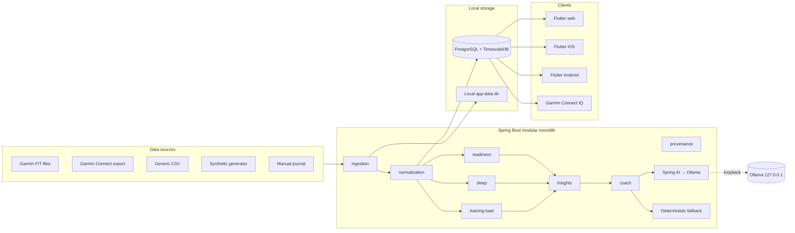

# Open Wearable Insights

> Privacy-first, local-first wearable analytics that combines detailed Garmin
> health and activity data with transparent recovery, sleep, training-load, and
> coaching insights — explainable by design, useful without a cloud.

[]()
[](./LICENSE)
[]()
[]()
[]()
[]()

---

## What this is

`open-wearable-insights` is a personal, privacy-first wearable analytics product.
It ingests detailed physiological and activity data captured by Garmin watches
(via FIT files and Garmin Connect exports), normalizes it into a canonical model,
and produces **transparent, versioned, explainable** recovery, sleep, training-load,
and coaching insights.

The goal is to pair Garmin's rich data capture with the clarity of interpretation,
coaching, and recovery guidance associated with products like WHOOP — **without**
copying any vendor's proprietary formula, score, or visual design, and **without**
sending any health data to a cloud.

### Why?

- Garmin captures substantially more detailed activity, training, and
  physiological data than most consumer recovery bands.
- Recovery-oriented products historically present that data through clearer
  recovery, strain, sleep, behavioral, and coaching insights.
- This project builds a product that uses detailed wearable data to generate
  understandable, personalized, transparent, and useful insights.
- The first customer is the developer. The first deployment runs privately and
  locally. The architecture is designed to evolve into a real multi-user
  product later.

---

## Core principles (non-negotiable)

1. **Local-first and private.** All core functionality works locally. No health
   data is sent to an external LLM, analytics service, telemetry platform,
   error-reporting service, or third-party API unless the user explicitly enables
   it. Ollama binds to loopback only by default. The application remains useful
   when the LLM is unavailable or disabled. Complete local data export and
   deletion is provided.
2. **Explainable rather than mysterious.** Numerical scores are generated by
   deterministic, versioned, testable analytics code. The LLM may explain
   computed results, identify patterns, summarize trends, and produce coaching
   language — it never invents the score. Every score exposes its inputs,
   provenance, baseline, factor contributions, missing-data treatment,
   confidence, algorithm version, plain-language explanation, and limitations.
3. **Product-quality engineering.** Clean boundaries, automated migrations,
   typed contracts, automated tests, security controls, CI checks, ADRs,
   observable analytics, original visual design, proper documentation,
   incremental pull requests.
4. **Health-safety boundary.** This is a wellness and fitness analytics product,
   not a diagnostic medical device. It does not diagnose illnesses, recommend
   medications, or direct medical treatment. It does not present fitness insights
   as medical facts, conceal uncertainty, or claim medical validation.

---

## Architecture at a glance



- **Backend**: Java 21, Spring Boot 3.5.6, Spring Modulith, Spring AI 1.0.1
  (Ollama), Spring Security, OpenAPI 3, Flyway, Bean Validation, Testcontainers,
  Micrometer. Gradle Kotlin DSL.
- **Database**: PostgreSQL 16 + TimescaleDB extension. Relational + hypertable
  time-series + JSONB raw payloads. UTC storage with source time zone preserved.
  Provenance on every record.
- **Frontend**: Flutter (web first; iOS/Android later). Riverpod, go_router,
  Dio, Freezed/json_serializable, fl_chart, flutter_secure_storage.
- **Local AI**: Ollama bound to `127.0.0.1`, default model `qwen3:8b`,
  configurable. Constrained prompt, structured validated output, deterministic
  fallback engine when the LLM is unavailable.
- **Raw files**: configurable local app-data directory outside the repo;
  checksums/status in Postgres; storage interface swappable to S3-compatible
  later (no MinIO in the initial runtime).

See [`docs/architecture/`](./docs/architecture/) for full system context,
container, component, and data-model views, and ADRs.

---

## Repository layout

```text
open-wearable-insights/
├── apps/
│   ├── flutter/                 # Flutter web/iOS/Android client
│   └── garmin-connect-iq/       # Connect IQ watch app (Phase 5)
├── services/
│   └── api/                     # Spring Boot modular monolith
├── packages/
│   ├── api-contracts/           # OpenAPI/DTOs shared across clients
│   └── test-data/               # Synthetic generator + synthetic FIT fixtures
├── infrastructure/
│   ├── docker/                  # docker-compose for local dev
│   └── github/                  # CI/reusable workflows
├── docs/                        # Product, UX, architecture, analytics, AI,
│                                # security, QA, runbooks
├── scripts/                     # dev-up, dev-down, bootstrap
├── .github/                     # PR template, issue templates, CI, Dependabot
├── .clinerules/                 # Cline rules for this project
├── README.md  CONTRIBUTING.md  SECURITY.md  CODE_OF_CONDUCT.md
├── CHANGELOG.md  NOTICE  LICENSE
```

---

## Quick start (Phase 1 target)

> Prerequisites: Docker, Java 21, Flutter, (optional) Ollama.

```bash
# 1. Start PostgreSQL + TimescaleDB (+ Ollama if installed)
./scripts/dev-up.sh

# 2. Run the backend
cd services/api && ./gradlew bootRun

# 3. Run the Flutter web client
cd apps/flutter && flutter run -d chrome

# 4. Load synthetic data + a synthetic FIT fixture
./scripts/load-synthetic.sh
```

The app must remain fully usable when Ollama is unavailable; a deterministic
template-based insight engine is the fallback.

See [`docs/runbooks/local-development.md`](./docs/runbooks/local-development.md)
for the full guide.

---

## Data privacy & safety

- **No real health data** is ever committed to this repository, test fixtures,
  screenshots, logs, issues, or PRs. Development and automated testing use
  **synthetic or explicitly anonymized data only**.
- `.gitignore` excludes health exports, FIT files (except synthetic fixtures),
  database files, Docker volumes, tokens, local configuration, IDE secrets,
  Ollama models, real-data screenshots, signing files, and Garmin developer keys.
- Local services bind to loopback by default. PostgreSQL and Ollama are never
  exposed publicly.
- See [`SECURITY.md`](./SECURITY.md) and [`docs/security/privacy-model.md`](./docs/security/privacy-model.md).

---

## Health-safety notice

Open Wearable Insights is a wellness and fitness analytics application. It is
**not** a medical device. It does not diagnose illnesses, recommend medications,
or direct medical treatment. It does not present fitness insights as medical
facts. Consult a qualified healthcare professional for medical concerns.

---

## Roadmap

| Phase | Focus | Status |
|---|---|---|
| 0 | Discovery & foundation: docs, ADRs, repo, CI skeleton | 🟡 in progress |
| 1 | Local vertical slice: synthetic data → FIT import → readiness → insights → coach | ☐ next |
| 2 | Personal Garmin import: guided UI, preview, undo, data-quality dashboard | ☐ |
| 3 | Insight intelligence: baselines, factors, correlations, local coach | ☐ |
| 4 | Mobile apps: iOS/Android, HealthKit, Health Connect | ☐ |
| 5 | Garmin Connect IQ watch app | ☐ |
| 6 | Productization: official APIs, hosted option (local-first preserved) | ☐ |

See [`docs/product/release-plan.md`](./docs/product/release-plan.md).

---

## Contributing

See [`CONTRIBUTING.md`](./CONTRIBUTING.md). We use Conventional Commits,
feature branches, small reviewable PRs, and protected `main`. No direct
commits to `main` after bootstrap.

## Security & vulnerability reporting

See [`SECURITY.md`](./SECURITY.md) for the public reporting process.

## License

Apache License 2.0. See [`LICENSE`](./LICENSE) and [`NOTICE`](./NOTICE) for
third-party attributions.