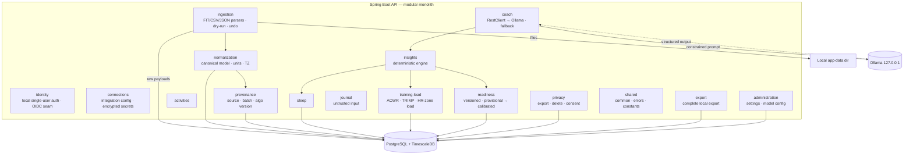

# Component View

## Module status (Phase 0–1)

| Module | Phase 1 | Notes |
|---|---|---|
| identity | stub + local auth | single-user; OIDC seam |
| connections | ✅ implemented | `WearableConnector` + `ConnectorRegistry`; Garmin FIT first (ADR-0006) |
| ingestion | ✅ implemented | FIT (via connections)/CSV/JSON/synthetic |
| normalization | ✅ implemented | canonical model |
| provenance | ✅ implemented | source/batch/algo version |
| activities | ✅ implemented (backend) | day-level step rollup + real session parsing (ADR-0006); no Flutter UI yet |
| sleep | partial | Phase 1 summary; Phase 3 deep |
| training-load | stub | Phase 3 |
| readiness | ✅ implemented | v0.1 provisional |
| journal | stub | Phase 3 |
| insights | ✅ implemented | deterministic engine |
| coach | ✅ implemented | RestClient → Ollama + fallback (ADR-0003 status update) |
| privacy | partial | export/delete Phase 1–2 |
| export | partial | Phase 1–2 |
| administration | stub | settings |

## Hexagonal layering (where useful)

Each module may follow:
- `domain/` — entities, value objects.
- `application/` — application services, ports.
- `adapter/in/` — REST controllers.
- `adapter/out/` — persistence, external clients.

Trivial modules avoid ceremonial abstraction.