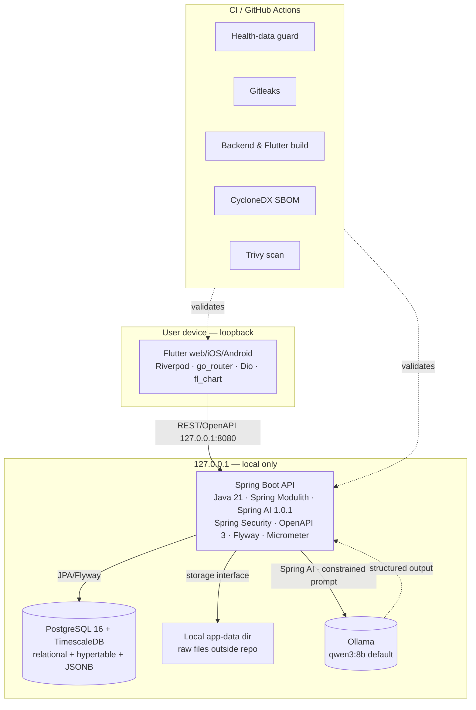

# Container View

## Containers

| Container | Tech | Binds to | Notes |
|---|---|---|---|
| Flutter client | Flutter, Riverpod, go_router, Dio, Freezed, fl_chart | browser/app | Web first; iOS/Android later |
| Spring Boot API | Java 21, Spring Boot 3.5.6, Spring Modulith, Spring AI 1.0.1, Spring Security, OpenAPI 3, Flyway, Micrometer | `127.0.0.1:8080` | Modular monolith; 15 target modules |
| PostgreSQL + TimescaleDB | PostgreSQL 16 + TimescaleDB extension | `127.0.0.1:5432` | Relational + hypertable + JSONB; UTC storage |
| Local app-data dir | filesystem | configurable path outside repo | Raw files; checksums in DB; S3-swappable interface |
| Ollama | Ollama, `qwen3:8b` default | `127.0.0.1:11434` | Optional; app works without it |
| CI | GitHub Actions | GitHub | Health-data guard, gitleaks, build, SBOM, Trivy |

## Data flow

1. User imports files → ingestion module → raw store (files) + DB (checksums,
   metadata, JSONB raw payloads).
2. Normalization module reads raw → canonical tables (normalized columns,
   UTC + source TZ, provenance).
3. Analytics modules (readiness, sleep, training-load) compute versioned derived
   metrics → DB (algorithm version column).
4. Insights module produces deterministic insight; coach module optionally
   requests LLM explanation via Spring AI → Ollama (loopback).
5. Flutter client reads REST/OpenAPI endpoints → displays.