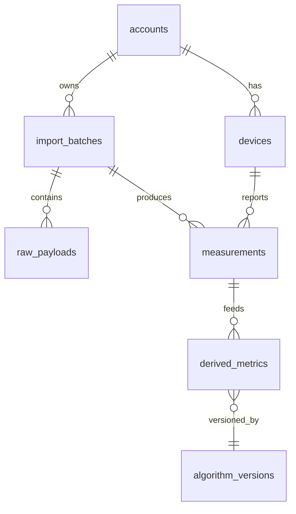

# Data Model

> Canonical model for Open Wearable Insights. PostgreSQL 16 + TimescaleDB.
> UTC storage with source time zone preserved. Provenance on every record.

## Categories (never overwrite one with another)

1. **Raw source measurements** — immutable JSONB vendor payloads + parsed raw.
2. **Normalized measurements** — explicit columns, units normalized, UTC + source TZ.
3. **Vendor-calculated metrics** — stored as-is with provenance; never mixed
   with app-computed metrics without normalization.
4. **App-derived metrics** — versioned (algorithm version column).
5. **LLM-generated narrative** — stored separately; never overwrites scores.

## Core tables (Phase 1 subset)

### `accounts`
- `id`, `email`, `created_at`, `local_only` (bool)

### `devices`
- `id`, `account_id`, `manufacturer`, `model`, `serial_hash`, `tz`

### `import_batches`
- `id`, `account_id`, `source` (fit/csv/json/synthetic/manual),
  `content_hash`, `status`, `imported_at`, `undo_at`

### `raw_payloads`
- `id`, `batch_id`, `payload` (JSONB), `checksum`, `received_at`

### `measurements` (hypertable, time-series)
- `time` (UTC timestamptz), `source_tz`, `account_id`, `device_id`,
  `metric_type` (hr/hrv/rhr/sleep_stage/steps/calories/stress/spo2/respiration/...),
  `value` (numeric), `unit` (normalized), `source` (raw/vendor/app),
  `provenance_id`, `quality_flag`

### `derived_metrics`
- `id`, `account_id`, `metric` (readiness/sleep_summary/training_load/...),
  `value` (jsonb), `algorithm_version`, `computed_at`, `baseline_period`,
  `confidence`, `data_quality`, `inputs` (jsonb), `explanation`

### `algorithm_versions`
- `id`, `name`, `version`, `description`, `released_at`

### `journal_entries`
- `id`, `account_id`, `time`, `behavior`, `value`, `note`,
  `treated_as_untrusted` (bool)

### `llm_outputs`
- `id`, `account_id`, `prompt_hash`, `output` (jsonb), `schema_valid` (bool),
  `fallback_used` (bool), `created_at`

## Time & units

- All times stored as `timestamptz` (UTC). `source_tz` preserved per measurement.
- Units explicitly represented (`unit` column) and normalized for computation.
- DST transitions handled explicitly; no silent timezone coercion.

## Provenance

Every imported or computed record has `provenance_id` linking to source, import
batch, and algorithm version. See [`data-provenance.md`](./data-provenance.md).

## Idempotency

- `import_batches.content_hash` enables duplicate detection.
- Re-importing the same file is a no-op.

## Versioning

- `derived_metrics.algorithm_version` pins the algorithm used.
- Golden tests pin known-good outputs per version.