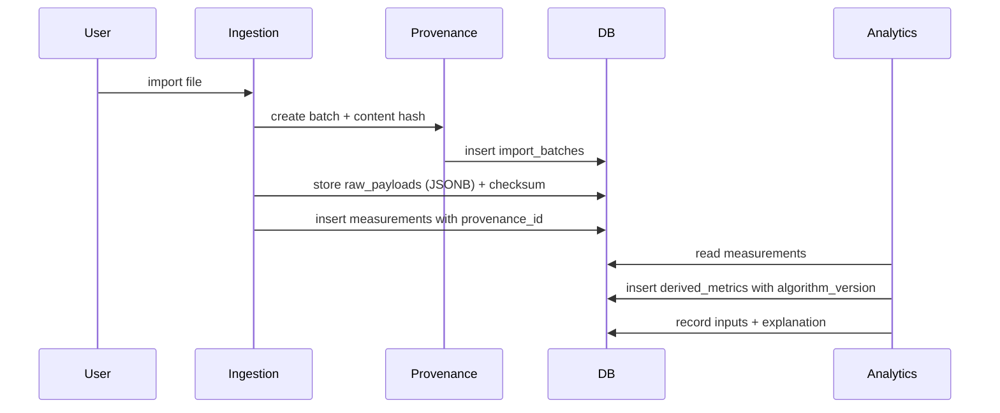

# Data Provenance Model

> Every imported or computed record carries provenance: source, import batch,
> and algorithm version. This is non-negotiable for explainability.

## Provenance record

Each provenance record links a measurement or derived metric to:

- **Source**: where the data came from
  - `fit` (Garmin FIT file)
  - `csv` (generic CSV)
  - `json` (Garmin Connect JSON export)
  - `synthetic` (test-data generator)
  - `manual` (journal entry)
  - `vendor_api` (future official API)
  - `app_computed` (derived by this application)
- **Import batch**: the `import_batches.id` that introduced the record.
- **Algorithm version**: for derived metrics, the `algorithm_versions.id`.
- **Timestamp**: when the record was imported or computed.
- **Content hash**: for imports, the file content hash (idempotency).

## Lifecycle

## Undo

- An import batch can be undone.
- Undo deletes all measurements and derived metrics produced from that batch.
- Raw payloads may be retained (configurable) or deleted.
- The undo is recorded in `import_batches.undo_at`.

## Versioning

- Derived metrics always record `algorithm_version`.
- Changing an algorithm creates a new version; old results are not silently
  overwritten. Golden tests pin known-good outputs per version.
- A methodology change requires an ADR, not a silent rebaseline.

## Explainability contract

Every score exposes:
- Input variables (which measurements fed it).
- Data source and provenance (source, batch, algorithm version).
- Baseline period (e.g., 30-day rolling).
- Contribution of each factor (positive/negative).
- Missing-data treatment (imputation or exclusion; explicitly stated).
- Confidence or data-quality level.
- Algorithm version.
- Plain-language explanation.
- Known limitations.