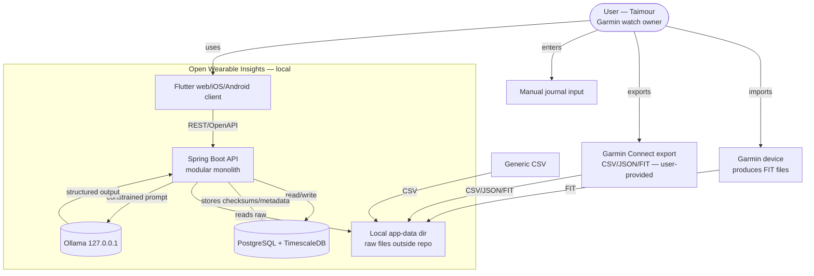

# System Context

## Boundaries

- **In scope**: local ingestion, normalization, storage, analytics, insights,
  coaching, Flutter client, local LLM integration.
- **Out of scope (Phase 0–1)**: official Garmin Health/Activity/Training APIs,
  WHOOP API, Apple HealthKit, Android Health Connect, Connect IQ app, hosted
  multi-user deployment. These have interface seams but are not implemented.
- **Never in scope**: unofficial Garmin Connect password scraping; medical
  diagnosis; copying proprietary formulas/UI.

## External actors

- **User**: imports data, views insights, asks coach, manages privacy.
- **Garmin device**: produces FIT files (via file import, not live API in MVP).
- **Ollama (local)**: optional local LLM; loopback only.

## Trust boundaries

- All services bind to `127.0.0.1`.
- No inbound ports from the network except the loopback API.
- Raw files live outside the repo; only checksums/metadata in DB.
- LLM receives only a constrained, structured summary — never raw DB access.